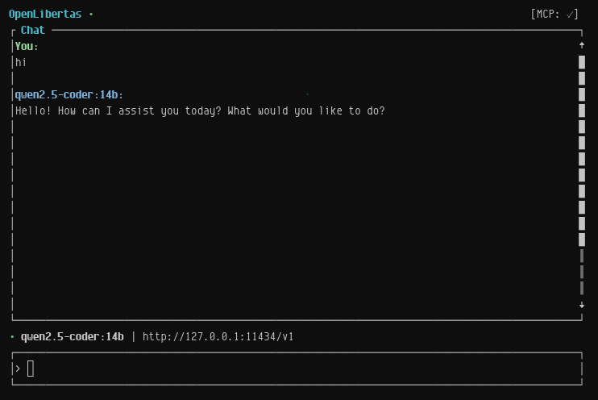

# OpenLibertas



A terminal-based AI chat client with multi-provider support, MCP tools, session management, and intuitive TUI navigation.

> **Free Forever** — OpenLibertas will be free to use forever. No subscriptions, no paywalls, no feature gating.

> **Warning:** This project is under active development and is buggy. PRs welcome.

[](https://github.com/sponsors/openlibertas)

### 💝 Support OpenLibertas

🚀 **If OpenLibertas helps you, consider [sponsoring](https://github.com/sponsors/openlibertas) — 100% of support goes to keeping it free forever.**

- **$5/month**: Coffee tier ☕ - Eternal gratitude + sponsor badge
- **$25/month**: Bug prioritizer 🐛 - Priority support + name in [SPONSORS.md](SPONSORS.md)
- **$100/month**: Corporate backer 🏢 - Logo placement + monthly office hours
- **$500/month**: Infrastructure partner 🚀 - Direct support + roadmap input

[**🎯 Become a Sponsor**](https://github.com/sponsors/openlibertas) | See our amazing [sponsors](SPONSORS.md) 🙏

---

## Features

- **Multi-Provider Support** - Connect to any OpenAI-compatible endpoint (llama.cpp, Ollama, vLLM, Kimi, GLM) for local or remote inference
- **Voice Mode** - Push-to-talk with Ctrl+Space using ElevenLabs STT/TTS. Speak naturally, hear responses read aloud.
- **MCP Tool Integration** - Discover and use tools from Model Context Protocol servers (web search, browser automation, docker, etc.)
- **Built-in Tools** - Native tools for file operations, shell commands, git, web search, and more — no MCP server required
- **Autonomous Agents** - 15 agent personas for different tasks: coding, research, orchestration, code review, and more. Agents use tools autonomously to complete multi-step workflows.
- **Dynamic Temperature** - Adjust model creativity on the fly with `/temp 0.2` for precise code or `/temp 0.8` for creative writing
- **Session Management** - Save, load, and manage chat sessions with auto-generated names (model + timestamp)
- **File Context** - Attach files inline with `@path/to/file` syntax
- **Agent Personas** - 15 specialized agent personalities loaded from `personas/*.md` files
- **Input History** - Navigate previous inputs with Up/Down arrows
- **Mouse Support** - Scroll chat output with mouse wheel
- **Slash Commands** - Tab-autocompleted commands for all operations
- **Connection Status** - Real-time indicator showing backend health
- **Auto-Scroll** - Follows streaming responses, stops when you scroll up
- **Keyboard Help** - Press `F1` or `?` for a searchable help panel

## Installation

```bash
cargo install --path .
```

Or build from source:

```bash
git clone https://github.com/openlibertas/openlibertas
cd openlibertas
cargo build --release
```

Binary will be at `target/release/openlibertas`.

### Non-Interactive Install (for agents/automation)

```bash
# Clone and build without prompts
git clone https://github.com/openlibertas/openlibertas.git /tmp/openlibertas
cd /tmp/openlibertas
cargo build --release 2>&1 | tail -5

# Install binary to a location in PATH
mkdir -p ~/.local/bin
cp target/release/openlibertas ~/.local/bin/

# Create config directory
mkdir -p ~/.config/openlibertas

# Write minimal config (edit API keys before use)
cat > ~/.config/openlibertas/config.toml << 'EOF'
[[providers]]
name = "local"
base_url = "http://127.0.0.1:11435/v1"
api_key = "sk-local"
enabled = true

max_tokens = 4096
EOF

echo "Install complete. Run: openlibertas"
```

## Configuration

Config file: `~/.config/openlibertas/config.toml`

```toml
[[providers]]
name = "ollama"
base_url = "http://127.0.0.1:11434/v1"
api_key = "sk-local"
enabled = true
supports_tools = true

[[providers]]
name = "llamacpp"
base_url = "http://localhost:8080/v1"
api_key = "sk-local"
enabled = true
supports_tools = true

model = "qwen2.5-coder:14b"
max_tokens = 4096
auto_save = true

# Optional: ElevenLabs voice configuration
elevenlabs_api_key = "your-key-here"
elevenlabs_voice_id = "your-voice-id"

# Optional: Preferred audio input device
input_device = "Bose Bluetooth Speaker"
```

### Config Options

| Option | Default | Description |
|--------|---------|-------------|
| `model` | none | Default model to use |
| `max_tokens` | 2048 | Maximum tokens per response |
| `auto_save` | false | Automatically save conversations |
| `input_device` | none | Preferred audio input device for voice |
| `filter_require_voice_and_tools` | false | Only show models that support both voice and tools |

Environment variables override config values:
- `OPENLIBERTAS_URL` - Override base URL
- `OPENLIBERTAS_API_KEY` - Override API key
- `OPENLIBERTAS_MODEL` - Default model
- `OPENLIBERTAS_MAX_TOKENS` - Max tokens per request

## HTTP Server

Run the headless HTTP server with:

```bash
cargo run -p openlibertas-server
# or
PORT=8080 cargo run -p openlibertas-server
```

Set `OPENLIBERTAS_API_KEY` to require Bearer-token authentication on all endpoints.

### API Endpoints

| Endpoint | Method | Description |
|----------|--------|-------------|
| `/health` | GET | Server and provider health status |
| `/api/status` | GET | Current model, provider, and message count |
| `/api/history` | GET | Current session messages |
| `/api/clear` | POST | Clear the current session |
| `/api/chat` | POST | Send a message and receive a response |
| `/api/chat/stream` | POST | Stream a response as SSE |
| `/api/sessions` | GET | List saved sessions |
| `/api/session/save` | POST | Save current session |
| `/api/session/load` | POST | Load a saved session |
| `/api/session/delete` | POST | Delete a saved session |
| `/api/export` | POST | Export current session to markdown/json/txt |
| `/api/voice/stt` | POST | Speech-to-text |
| `/api/voice/tts` | POST | Text-to-speech |
| `/v1/chat` | POST | OpenAI-compatible chat completion |
| `/v1/chat/stream` | POST | OpenAI-compatible streaming completion |
| `/v1/models` | GET | List available models |

### Export Example

```bash
curl -X POST http://localhost:3000/api/export \
  -H "Content-Type: application/json" \
  -d '{"format": "markdown"}'
```

## Local Models with llama.cpp

OpenLibertas works with any OpenAI-compatible API, including [llama.cpp server](https://github.com/ggml-org/llama.cpp/blob/master/examples/server/README.md).

### Setup

1. **Download a GGUF model** (Qwen3, Llama3, etc.)
2. **Start llama.cpp server with tool support:**

```bash
./llama-server \
  -m Qwen3-8B-Instruct-Q6_K.gguf \
  --host 0.0.0.0 --port 8080 \
  --jinja \
  --ctx-size 8192 \
  --n-gpu-layers -1
```

- `--jinja` is **required** for tool-aware templating
- For Qwen models, download the `chat_template.jinja` from HuggingFace if needed
- See [llama.cpp function calling docs](https://github.com/ggml-org/llama.cpp/blob/master/docs/function_calling.md)

3. **Add to your config:**

```toml
[[providers]]
name = "llamacpp"
base_url = "http://localhost:8080/v1"
api_key = "sk-local"
enabled = true
supports_tools = true
```

### `supports_tools`

Set `supports_tools = false` for providers that don't support function calling (basic GGUFs without `--jinja`, older Ollama models, etc.). When false, OpenLibertas will **not** send the `tools` array, avoiding errors.

```toml
[[providers]]
name = "basic-local"
base_url = "http://localhost:11434/v1"
enabled = true
supports_tools = false
```

## Agents

OpenLibertas includes a multi-agent system with 15 specialized personas. Each persona has a distinct system prompt that shapes how the agent approaches tasks.

### How It Works

1. Open the agent panel with `/agents`
2. **Orchestrator** is selected by default — it coordinates other agents automatically
3. Enable agent status
4. Send your request normally
5. The active agent will use tools, delegate to specialist personas as needed, and continue until the task is complete
6. Status shows in the header: `[Agents: ● 3/10 Persona]`
7. Maximum 10 iterations per task (configurable, prevents infinite loops)
8. Cancel anytime with `Esc`

### Multi-Agent Delegation

Agents can **switch personas mid-task** to delegate work to specialists:

- **Orchestrator** → Routes tasks and coordinates specialist agents
- **Seeker** → Explores the codebase to find patterns and references
- **Pathfinder** → Searches external documentation and APIs
- **Sage** → Reviews code and architecture decisions
- **Strategist** → Plans complex implementations before coding
- **Artisan** → Handles deep, focused implementation work
- **Steward** → Tracks progress and manages todos

When an agent delegates, the persona switches transparently and the new agent continues with the appropriate context. You can see persona switches in the chat history.

### Agent Personas

| Persona | Role | Best For |
|---------|------|----------|
| **Orchestrator** | Central coordinator | Multi-agent task routing, delegation, verification |
| **Coding** | Implementation specialist | Writing, debugging, refactoring code |
| **Research** | Systematic investigator | External research, source evaluation, synthesis |
| **Creative** | Creative strategist | Writing, design, brainstorming, content |
| **Captain** | Task coordinator | Multi-step projects, dependency tracking |
| **Artisan** | Deep autonomous worker | End-to-end implementation, thorough testing |
| **Sage** | Read-only consultant | Architecture review, debugging, trade-off analysis |
| **Pathfinder** | External search | Documentation, APIs, library internals |
| **Seeker** | Codebase explorer | Navigation, pattern finding, cross-references |
| **Witness** | Document analyst | PDFs, images, diagrams, precise observation |
| **Strategist** | Pre-planning consultant | Scope analysis, risk assessment, phased plans |
| **Examiner** | Plan reviewer | Quality assurance, gap detection, verification |
| **Steward** | Task tracker | Todo management, progress monitoring, blockers |
| **Visionary** | Strategic architect | Roadmaps, technology strategy, scalability |
| **Operative** | Precise executor | Well-defined tasks, methodical execution |

Personas are loaded from `personas/*.md` files at runtime. Each file's first line is the name (`# Name`), and the rest is the system prompt. Add your own by creating a new `.md` file in the `personas/` directory.

### Agent Use Cases

- **Multi-Agent Research**: "Search for recent Rust async runtime benchmarks" → Orchestrator delegates to Research → Results synthesized by Orchestrator
- **Codebase Analysis**: "Find all TODO comments" → Orchestrator → Seeker explores → Steward tracks → Coding implements
- **Debugging**: "Check the last 50 lines of logs, identify errors, suggest fixes" → Orchestrator → Seeker finds code → Sage reviews → Coding fixes
- **Architecture Review** (Sage): "Review this PR for security issues and performance bottlenecks"
- **Pre-Implementation Planning** (Strategist): "Plan the migration from sync to async for this module"
- **End-to-End Implementation** (Artisan): "Add a new REST endpoint with tests and documentation"

## MCP Servers

OpenLibertas reads MCP server configuration from `~/.config/opencode/opencode.json`:

```json
{
  "mcp": {
    "websearch": {
      "type": "remote",
      "url": "https://mcp.exa.ai/mcp?tools=web_search_exa",
      "enabled": true
    },
    "docker": {
      "type": "local",
      "command": ["npx", "-y", "@swartdraak/docker-mcp-server"],
      "enabled": true
    }
  }
}
```

## Usage

Launch: `openlibertas`

Startup skips the model menu if you have a previous session. Goes straight to chat.

### Chat Input

- **Type normally** - Send messages to the AI
- **`@path/to/file`** - Attach file content inline (e.g., `@src/main.rs`)
- **`/`** - Shows all slash commands
- **`/s<Tab>`** - Autocomplete to `/save`, `/sessions`, etc.
- **Up/Down** - Navigate input history
- **PageUp/PageDown** - Scroll chat output
- **Mouse scroll** - Scroll chat output
- **Enter** - Send message
- **Esc** - Close panels / cancel streaming / go to model selection
- **F1** or **?** - Toggle help panel
- **Ctrl+Q** - Quit

### Slash Commands

| Command | Description |
|---------|-------------|
| `/help` | Show keyboard shortcuts panel |
| `/tools` | Toggle MCP tools panel |
| `/model <name>` | Switch to specific model |
| `/models` | Open model selection menu |
| `/temp <0.0-2.0>` | Set model temperature (e.g., `/temp 0.2` for precise, `/temp 0.8` for creative) |
| `/voice` | Toggle voice mode (STT/TTS) |
| `/voice_device` | Select audio input device |
| `/clear` | Clear current conversation |
| `/new` | Start new empty session |
| `/save [name]` | Save session (auto-names if no name given) |
| `/load <name>` | Load saved session |
| `/sessions` | Open session manager popup |
| `/delete <name>` | Delete saved session |
| `/export <file>` | Export chat to markdown |
| `/mcp` | Toggle MCP servers panel |
| `/agents` | Open agent configuration panel |
| `/poke` | Toggle poke mode (send [POKE] on click) |
| `/quit` | Quit |

## Voice Mode

OpenLibertas supports voice input and output via ElevenLabs:

- **Ctrl+Space** - Hold to record, release to send (push-to-talk)
- **Voice is processed locally** through your configured provider (Ollama, llama.cpp, etc.)
- **Responses are read aloud** via ElevenLabs TTS

### Setup

Add to your `~/.config/openlibertas/config.toml`:

```toml
elevenlabs_api_key = "your-key-here"
elevenlabs_voice_id = "your-voice-id"
```

### Commands

- `/voice` - Toggle voice mode on/off
- `/voice_device` - Select audio input device (persists to config)

## Built-in Tools

OpenLibertas includes native tools that work without any MCP servers:

| Tool | Description |
|------|-------------|
| `shell` | Execute shell commands (sandboxed with validation) |
| `read_file` | Read file contents |
| `write_file` | Write or overwrite files |
| `str_replace_file` | Find-and-replace in files |
| `glob` | Find files by pattern |
| `grep` | Search file contents |
| `git` | Run git commands |
| `web_search` | Search the web |
| `fetch_url` | Fetch and read a URL |
| `tmux` | Interact with tmux sessions |
| `think` | Step-by-step reasoning before acting |
| `switch_persona` | Change agent persona mid-task |
| `spawn_subagent` | Delegate to a specialist agent |

Shell commands execute with validation and safety checks. Destructive operations (write, replace) require YOLO mode (`/yolo`). Read-only operations execute immediately.

## Native Tool Support

When `supports_tools = true` (default), OpenLibertas uses native function calling via the OpenAI API `tools` parameter. Models that support native tools (Qwen2.5, Llama3.1, GPT-4, Claude) receive tool definitions through the standard API.

For models that don't support function calling, set `supports_tools = false` and OpenLibertas falls back to text-based tool instructions.

### Session Names

Auto-generated: `{model}-{YYYY-MM-DD-HHMM}`

Example: `qwen2.5-coder-14b-2025-05-02-0015`

Saved to: `~/.local/share/openlibertas/*.json`

### Model Selection Screen

- **↑/↓** - Navigate models
- **Enter** - Select model
- **q** - Quit

Models from all configured providers are grouped by provider:
```
[LOCAL]
  qwen2.5-coder-14b
  llama3.1-8b
[LLAMACPP]
  Qwen3-8B-Instruct-Q6_K
```

## Architecture

```
openlibertas/
├── Cargo.toml                    # Workspace manifest
├── Cargo.lock                    # Locked dependencies
├── crates/
│   ├── openlibertas-core/        # Shared library
│   │   ├── src/
│   │   │   ├── backend.rs        # HTTP client, SSE streaming, tool calls
│   │   │   ├── backend/
│   │   │   │   └── registry.rs   # Multi-provider backend registry
│   │   │   ├── commands.rs       # Slash command parsing and execution
│   │   │   ├── config.rs         # Config loading (TOML + env vars)
│   │   │   ├── conversation.rs   # Message building, file context, tool results
│   │   │   ├── domain.rs         # Core types (Message, Role, ChatEvent, etc.)
│   │   │   ├── export.rs         # Session export (Markdown, JSON, Plaintext)
│   │   │   ├── lib.rs            # Library exports
│   │   │   ├── mcp.rs            # MCP client, JSON-RPC, tool discovery
│   │   │   ├── prompt.rs         # Agent persona system prompt loader
│   │   │   ├── search.rs         # In-conversation text search
│   │   │   ├── state.rs          # Last model persistence
│   │   │   └── store.rs          # Session save/load (JSON)
│   ├── openlibertas-tui/         # Terminal UI application
│   │   └── src/
│   │       ├── main.rs           # Event loop, runtime wiring, agent loop
│   │       ├── app.rs            # App state, slash commands, input handling
│   │       ├── event.rs          # Unified event stream (input + chat + MCP)
│   │       ├── markdown.rs       # Markdown renderer for chat output
│   │       ├── terminal.rs       # TerminalGuard RAII, panic hook
│   │       ├── theme.rs          # Color theme system
│   │       └── ui.rs             # Ratatui rendering, panels, help
│   └── openlibertas-server/      # HTTP server
│       └── src/
│           └── main.rs           # Axum server for remote access
├── personas/                     # Agent persona markdown files
│   ├── general.md
│   ├── coding.md
│   ├── research.md
│   ├── creative.md
│   ├── captain.md
│   ├── artisan.md
│   ├── sage.md
│   ├── pathfinder.md
│   ├── seeker.md
│   ├── witness.md
│   ├── strategist.md
│   ├── examiner.md
│   ├── steward.md
│   ├── visionary.md
│   └── operative.md
└── README.md
```

## License

MIT
